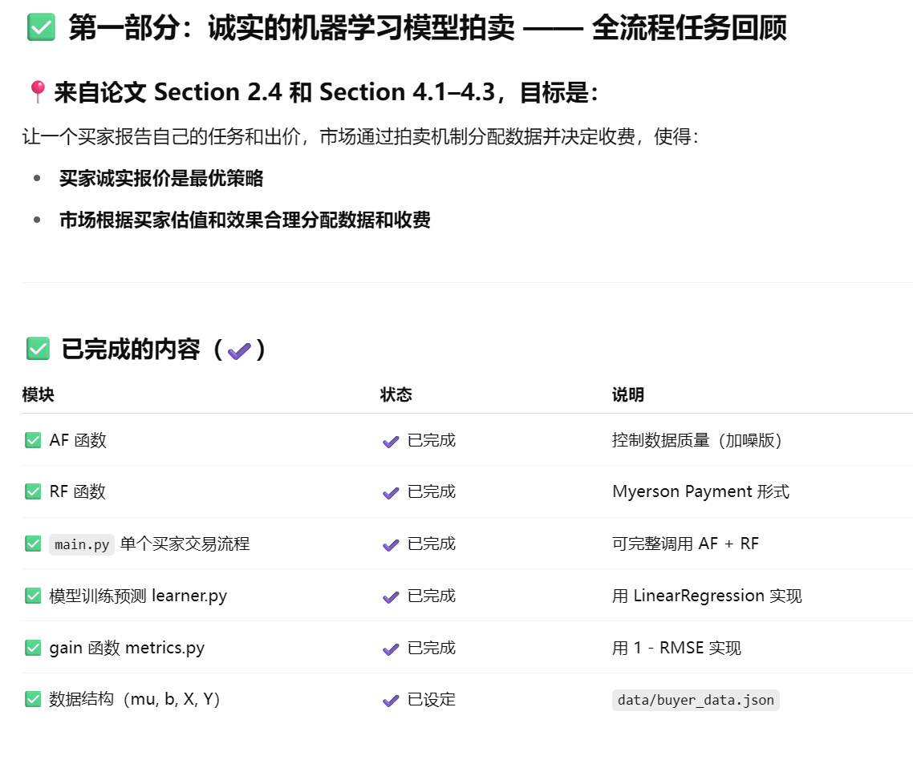

# 第一部分：诚实的机器学习模型拍卖



现在我们来按顺序逐步实现你负责的“诚实的机器学习模型拍卖”模块，即 `market/auction.py` 文件中的 AF + RF 部分。


---
# 代码结构一览
负责的 auction.py 模块可以包含如下代码结构：

``` py
# market/auction.py
import numpy as np
from models.learner import train_and_predict
from utils.metrics import gain_function

def allocation_function(...): ... #AF
def revenue_function(...): ...  #RF

```

---

## 🔧 第一步：实现 Allocation Function（AF）

### 📍对应论文：

* Section 4.1，特别是公式 (Example 4.1)、(Example 4.2)
* 图 3：展示了 AF 的加噪/降质行为
* Theorem 5.1：确保单调性可实现 Truthfulness

### 🧠 原理说明：

* 如果买家的出价 `bn` ≥ 当前价格 `pn`，则直接提供完整数据；
* 如果 `bn < pn`，则对数据加噪声或遮蔽，模拟“买不起就降质供给”。

---

### ✅ 示例实现（建议放入 `auction.py`）：

```python
import numpy as np

def allocation_function(X: np.ndarray, pn: float, bn: float, noise_std: float = 1.0) -> np.ndarray:
    """
    AF∗：加噪版数据分配函数，对应论文 Example 4.1
    如果 bn < pn，对原始数据添加高斯噪声，噪声强度 ∝ (pn - bn)
    """
    if bn >= pn:
        return X.copy()
    else:
        noise = np.random.normal(loc=0.0, scale=noise_std, size=X.shape)
        return X + (pn - bn) * noise
```

---

## 🔧 第二步：实现 Revenue Function（RF）

### 📍对应论文：

* Section 4.1，公式 (3)：

  $$
  RF^*(p_n, b_n, Y_n) = b_n \cdot G(Y_n, \hat{Y}_n) - \int_0^{b_n} G(Y_n, \hat{Y}_n(z)) \, dz
  $$
* 用到了 Myerson Payment Function 确保 Truthfulness（Property 3.1）

---

### ✅ 示例实现（`auction.py`）：

```python
from utils.metrics import gain_function  # 需你们自己定义，比如 1 - RMSE
from models.learner import train_and_predict  # 输入 X_tilde, Y → 输出 Y_hat
from scipy.integrate import quad  # 用于积分

def revenue_function(X: np.ndarray, Y: np.ndarray, pn: float, bn: float, gain_func, model_func, steps: int = 20) -> float:
    """
    实现 RF∗(pn, bn, Yn)
    G = gain_func(Y_true, Y_pred)
    """
    # 第一步：获取买家实际收益 G(bn)
    X_alloc = allocation_function(X, pn, bn)
    Y_hat = model_func(X_alloc, Y)
    G_b = gain_func(Y, Y_hat)

    # 第二步：计算积分项 ∫₀^bn G(z) dz，用简单Riemann近似
    zs = np.linspace(0, bn, steps)
    integral = 0
    for z in zs:
        X_z = allocation_function(X, pn, z)
        Y_z = model_func(X_z, Y)
        G_z = gain_func(Y, Y_z)
        integral += G_z * (bn / steps)

    return bn * G_b - integral
```

---

## 📌 第三步：你们要准备的接口模块

你负责的是核心 auction 逻辑，但要确保以下两个函数存在：

* `train_and_predict(X, Y)` → 返回 `Y_hat`
  放在 `models/learner.py`，比如简单的线性回归或 SVR

* `gain_function(Y_true, Y_pred)` → 返回 0 到 1 的值（越高越好）
  放在 `utils/metrics.py`，比如 `1 - RMSE(Y, Y_hat)`

---

## ✅ 进度小结

你目前负责的 `auction.py` 模块可以包含如下代码结构：

```python
# market/auction.py
import numpy as np
from models.learner import train_and_predict
from utils.metrics import gain_function

def allocation_function(...): ...
def revenue_function(...): ...
```

---

## 🔜 下一步建议

* 请先确认你是否已有：

  * 模拟数据（在 `data/buyer_data.json` 中）
  * 训练模型 `train_and_predict()` 的实现
  * gain 函数 `gain_function()` 实现（如 1 - RMSE）
* 如果有，我可以帮你写好 main.py 的流程调用入口，让系统真正跑通一位买家的交易。
* 如果你还没有 learner 或 gain，我可以优先帮你写这两个。

你想先进行哪一部分？是否需要我帮你写 `learner.py` 和 `metrics.py`？


---

# 实现建议
非常好，那我们从最基础的部分开始：准备好你第一步（诚实拍卖机制）所依赖的通用接口和模块。按照推荐顺序，我们将完成：


## ✅ 阶段一：先行准备工作（支撑诚实拍卖机制）

### 🔧 Step 1：定义 gain 函数 `gain_function`（放在 `utils/metrics.py`）

📍**对应论文**：

* Section 2.2 - 定义了 prediction gain 函数 $G(Y, \hat{Y})$，论文中建议使用：

  * 对回归：`1 - RMSE`
  * 对分类：`Accuracy`

💡为了简单起步，我们先做一个统一函数，后续可扩展。

```python
# utils/metrics.py

import numpy as np

def rmse(y_true, y_pred):
    return np.sqrt(np.mean((y_true - y_pred) ** 2))

def gain_function(y_true, y_pred, task='regression'):
    """
    G(Y, Ŷ) ∈ [0, 1]，用于衡量预测质量。
    regression: 使用 1 - RMSE 的方式。
    classification: 使用 Accuracy。
    """
    if task == 'regression':
        return 1.0 - rmse(y_true, y_pred)
    elif task == 'classification':
        return np.mean(y_true == y_pred)
    else:
        raise ValueError("Unsupported task type.")
```

---

### 🔧 Step 2：定义简单模型 `train_and_predict`（放在 `models/learner.py`）

📍**对应论文**：

* Section 2.3 - `M(X) → Ŷ` 是一个任意机器学习模型，可自定义
* Section 4.1 - 举例说可用 Sklearn 模型、SparkML 等

💡我们先用最简单的 `LinearRegression` 进行回归预测

```python
# models/learner.py

import numpy as np
from sklearn.linear_model import LinearRegression

def train_and_predict(X: np.ndarray, Y: np.ndarray) -> np.ndarray:
    """
    给定特征 X 和标签 Y，拟合模型并预测 Y（使用自身训练数据）
    """
    model = LinearRegression()
    model.fit(X, Y)
    return model.predict(X)
```

---

### 🔧 Step 3：准备模拟数据文件 `data/buyer_data.json`

📍**对应论文**：

* Section 2.2 定义了 Buyer 的结构：

  * `Y`: 预测目标
  * `mu`: 真实估值
  * `b`: 公共报价（你将实现机制让它趋近 μ）
* Section 2.3 中所有特征 X 来自 seller pool（可统一定义）

💡初始模拟数据格式如下：

```json
[
  {
    "buyer_id": 1,
    "mu": 100.0,
    "X": [[0.1, 0.2], [0.3, 0.4], [0.5, 0.6]],
    "Y": [1.0, 2.0, 3.0]
  },
  {
    "buyer_id": 2,
    "mu": 80.0,
    "X": [[0.5, 0.1], [0.6, 0.2], [0.7, 0.3]],
    "Y": [2.0, 1.5, 3.5]
  }
]
```

你可以写一个脚本自动生成，也可以手动填几组数据。

---

### 🔧 Step 4：定义数据加载函数（供 `main.py` 使用）

```python
# utils/io.py  ←（你可以新建这个文件）

import json
import numpy as np

def load_buyer_data(path):
    with open(path, 'r') as f:
        data = json.load(f)
    # 转为 numpy 格式方便计算
    for buyer in data:
        buyer['X'] = np.array(buyer['X'])
        buyer['Y'] = np.array(buyer['Y'])
    return data
```

---

## ✅ 当前进度完成后你将拥有：

| 功能                     | 文件                     | 用途                |
| ---------------------- | ---------------------- | ----------------- |
| gain 函数（RMSE/Accuracy） | `utils/metrics.py`     | 用于评价模型预测效果        |
| 线性回归预测函数               | `models/learner.py`    | 用于训练并预测           |
| 模拟买家数据                 | `data/buyer_data.json` | 买家提交的任务和特征        |
| 数据加载函数                 | `utils/io.py`          | 用于在主程序中读取 JSON 数据 |

---

## 🔜 下一步建议

你完成以上后，我们就能继续写 `market/auction.py` 中的核心逻辑（AF + RF），并在 `main.py` 中调用一整个交易流程。

你可以回报我哪部分已完成，我就立即继续带你进入第一步“诚实拍卖机制”的正式实现。

是否现在我们就动手实现这些文件？需要我把所有这些代码一次性打包贴给你吗？


---

# 变量函数解释

当然，我来为你详细解释 **AF（Allocation Function）** 和 **RF（Revenue Function）** 的设计目的、工作原理以及它们在机制中扮演的角色，完全基于论文中的内容，但用更直白的语言说明。

---

## 🔍 一、AF：分配函数 Allocation Function

### 📌 论文出处

* Section 4.1 Allocation Function
* Figure 3 左侧
* Example 4.1 和 4.2（加噪 / mask）
* Assumption 1（单调性）

---

### ✅ 作用（直白地说）：

AF 决定了当一个买家出价 $b_n$ 时，市场“以什么质量”把数据分配给他。

* 如果你出得起价格 → 市场就“全额”把高质量数据给你。
* 如果你出不起 → 市场就给你“低质量”的数据（比如加噪声、缺失部分特征等）。

---

### ✅ 为什么要这样设计？

1. **为了“劣质数据”起到“惩罚出价低”的作用**：
   你 bid 得越少，数据质量越差，模型预测能力就越差，收益也越差。

2. **实现“真诚机制”**：
   论文的目标是让买家**有动力说实话**（即出价 $b_n = \mu_n$）。
   如果你不说实话，低估自己的估值，你就拿到差数据，反而吃亏。

---

### ✅ 数学表现

论文中推荐的实现（Example 4.1）：

$$
\tilde{X}_j(t) = X_j(t) + \max(0, p_n - b_n) \cdot \mathcal{N}(0, \sigma^2)
$$

意思是：如果你出价低于价格，就往数据里加噪声，噪声强度跟差价成正比。

---

### ✅ 对应在代码中（`allocation_function`）：

```python
if bn >= pn:
    return X.copy()
else:
    return X + (pn - bn) * noise
```

---

## 🔍 二、RF：收入函数 Revenue Function

### 📌 论文出处

* Section 4.1, 公式 (3)
* 图 3 右侧：收入面积
* 引用了经典机制设计中的 Myerson Payment Rule

---

### ✅ 作用（直白地说）：

RF 决定了市场向买家收多少钱。

但是它不是简单的“按使用的数据收钱”，而是按照买家**真实获得的效果**收钱（比如预测准确率的提高）。

---

### ✅ 为什么不能简单地按数据定价？

因为论文假设的背景是：
数据是“可复制”的（比如 CSV 文件），你用我也能用，不能像一台打印机那样“卖一台少一台”。

所以市场只能根据**你用了数据之后效果如何**来“事后收费”。

---

### ✅ 设计理念（Myerson Payment）：

收入函数：

$$
\text{RF}^*(p_n, b_n, Y_n) = b_n \cdot G(Y_n, \hat{Y}_n) - \int_0^{b_n} G(Y_n, \hat{Y}_n(z)) \, dz
$$

解释如下：

* 第一项 $b_n \cdot G$：你自己说“每提升一个点准确率，我值 $b_n$” → 乘上实际准确率提升，给你收费。
* 第二项 $\int_0^{b_n} G(z) dz$：是一个“折现项”，保证**真诚性**，防止你虚报价格拿到更大收益。

这个函数是经典机制设计中用来**保证买家说实话最优**的方式。

---

### ✅ 举例说明：

你愿意花 $$\$100$$ 来提升 1 单位的预测准确率。

* 如果你说实话（出价 100），你拿到好数据，准确率变高，系统收你大约 \$80 左右。
* 如果你虚报（出价 20），你只能拿到差数据，准确率变低，系统可能收你 \$5，但你得到的效果几乎为零，你后悔没说实话。

---

### ✅ 对应代码（`revenue_function`）核心逻辑：

```python
revenue = bn * G(bn) - ∫₀^bn G(z) dz
```

我们用数值积分（如 Riemann sum）近似这个积分：

```python
for z in zs:
    G_z = gain(Y, Y_hat(z))  # 不同 z 得到的不同模型效果
    integral += G_z * (bn / steps)
```

---

## ✨ 总结一句话

| 模块     | 用处              | 设计目的               |
| ------ | --------------- | ------------------ |
| **AF** | 控制数据质量（买得起给好数据） | 惩罚低出价，构建出价–效果关系    |
| **RF** | 决定收费（按效果收费）     | 保证说实话是买家最优选择（诚实机制） |

---


这是一个很好的问题。我们来仔细对比一下：

---

# 关于为什么 RF（收入函数的输出） ≠ 市场价格 pn

> **RF（收入函数的输出） ≠ 市场价格 pn**
> RF 是市场**实际向买家收费的金额**，而 pn 是市场**预先设定的价格基准线**。

换句话说：

* `pn` 是市场设定的“统一报价门槛”；
* `RF` 是机制根据买家实际出价 `bn` 和模型效果 `G` 后计算出来的个性化收费。

---

## ✅ 举个直观的例子：

假设你是买家：

* 你的估值：愿意为每单位准确率提升付 $b_n = 80$
* 当前市场价格 $p_n = 50$
* 模型最终准确率是 $G = 0.9$

你获得的真实收益是：

$$
b_n \cdot G = 80 \times 0.9 = 72
$$

但机制不会直接收你 \$72，它会**减去一个积分项**来保证你说实话：

$$
RF = 80 \cdot G - \int_0^{80} G(z) \, dz
$$

这个折扣积分一般会让你实际支付的 RF < $72$。

---

## ✅ 各个变量的本质对比：

| 项目               | 解释        | 控制者    | 作用         | 对买家行为的影响       |
| ---------------- | --------- | ------ | ---------- | -------------- |
| `pn`（定价）         | 当前市场的标准价  | 市场     | 决定分配质量（AF） | 出价 < pn → 降质数据 |
| `bn`（出价）         | 买家愿意支付的单价 | 买家     | 决定能否买到高质量  | 决定买家能否“买到”高质量  |
| `RF(pn, bn)`（收入） | 买家实际付款金额  | 机制（计算） | 真正收钱多少     | 被设计为让买家“说实话最优” |

---

## ✅ 为什么 RF 不等于 pn？

因为：

* 如果直接向买家收 **pn**，你就无法鼓励他们说实话。
* 如果直接向买家收 **bn**，他们会撒谎（虚报估值）。
* 所以用 **RF∗（Myerson payment）**：介于两者之间，确保真诚。

---

## 🧠 深入理解的一个图示（论文图3右半边）

* RF 其实是图中红色阴影部分的面积（买家的“有效付款”）；
* 而 pn 是蓝色竖线，表示数据质量变化的门槛。

图中说明了：**买家的付款（RF）来源于出价和预测性能的函数**，并不直接等于 pn。

---

## ✅ 最后再用一句话总结：

> 市场价格 $p_n$ 是一种“抽象门槛”，控制你是否能拿到好数据；
> 收入函数 $RF^*$ 是一种“智能结算方式”，控制你最后到底要为这份数据付多少钱。

---

如果你还想更深入，比如推导 RF 的数学期望，或者看看 pn 如何通过 MWU 学出来，我也可以继续带你往下讲。是否要进入下一步 “MWU 动态定价”？


